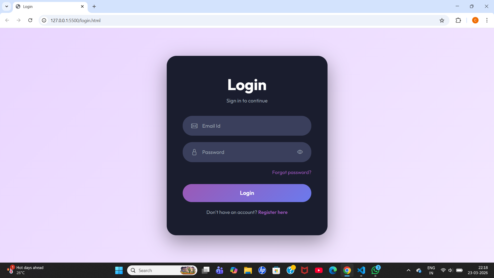
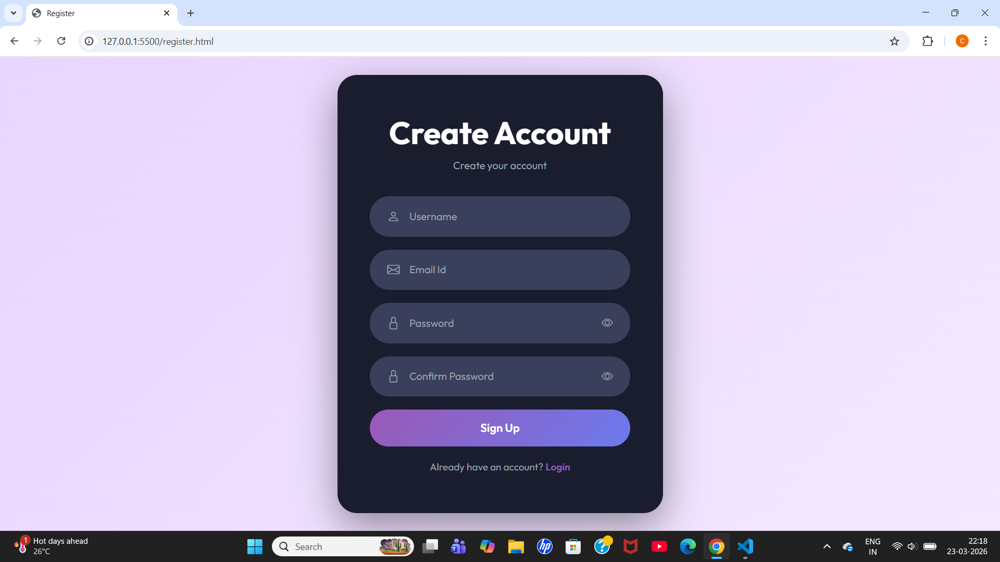
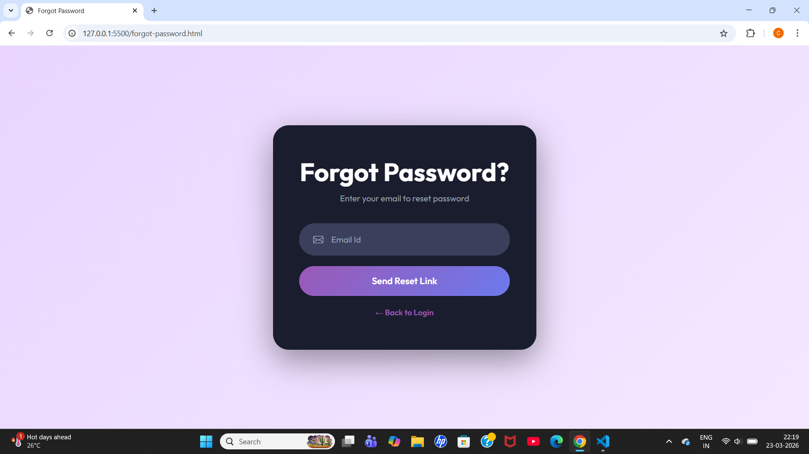
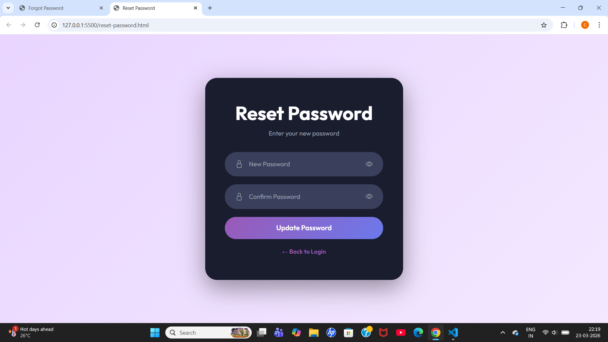
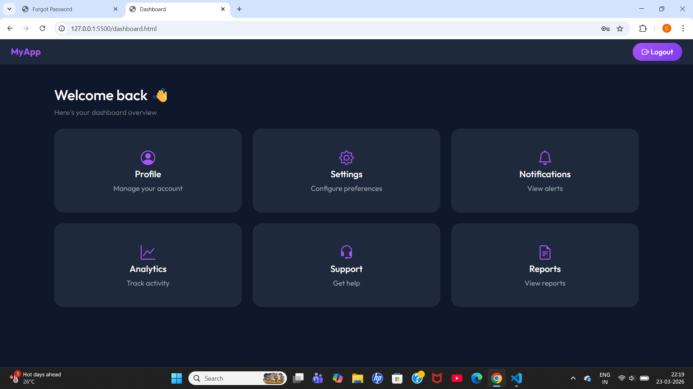

# Login & Authentication System

A simple login and authentication web application built using **HTML**, **CSS**, and **Bootstrap 5**.

---

## 📌 Project Description

This project is a multi-page authentication system. It includes pages for logging in, registering a new account, resetting a forgotten password, and a dashboard after login.

It was built as part of a web development assignment to practice Bootstrap integration, responsive design, and custom CSS styling.

---

## 📁 Project Files

```
project/
│
├── login.html           → Login page
├── register.html        → Register / Sign up page
├── forgot-password.html → Forgot password page
├── reset-password.html  → Reset password page
├── dashboard.html       → Dashboard (after login)
├── styles.css           → All custom styles
└── README.md            → This file
```

---

## 🌐 Pages Overview

### 1. Login Page (`login.html`)
- User enters their email and password to log in
- Has a "Forgot Password?" link
- Has a link to Register if no account exists
- Show/hide password toggle button

### 2. Register Page (`register.html`)
- User creates a new account with username, email, and password
- Confirms password with validation
- Shows error if passwords don't match

### 3. Forgot Password Page (`forgot-password.html`)
- User enters their email to receive a reset link
- Shows success message after submission

### 4. Reset Password Page (`reset-password.html`)
- User enters a new password and confirms it
- Shows error if passwords don't match
- Shows success message when updated

### 5. Dashboard Page (`dashboard.html`)
- Shown after successful login
- Displays 6 cards: Profile, Settings, Notifications, Analytics, Support, Reports
- Has a navbar with logout button

---

## 🛠️ Technologies Used

| Technology | Purpose |
|---|---|
| HTML5 | Page structure |
| CSS3 | Custom styling |
| Bootstrap 5.3 | Layout, components, responsiveness |
| Bootstrap Icons | Icons on inputs and cards |
| Google Fonts (Outfit) | Custom typography |
| JavaScript | Form validation, password toggle |

---

## ✨ Features

- ✅ Responsive design (works on mobile, tablet, desktop)
- ✅ Custom purple/violet color theme
- ✅ Smooth hover effects and transitions
- ✅ Password show/hide toggle
- ✅ Form validation with error messages
- ✅ Bootstrap cards, forms, buttons, and grid used throughout

---

## 📸 Screenshots

### Login Page


### Register Page


### Forgot Password Page


### Reset Password Page


### Dashboard Page

